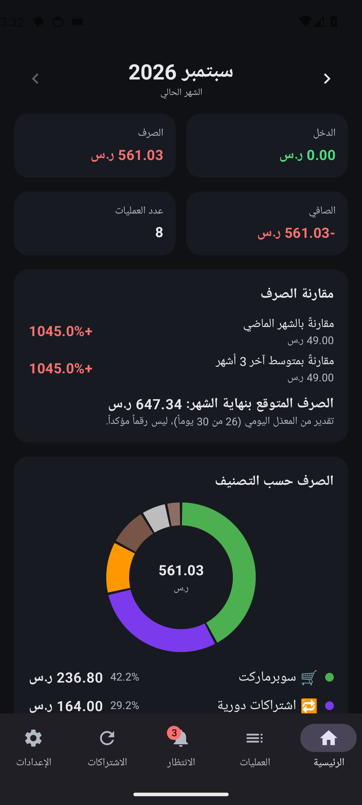
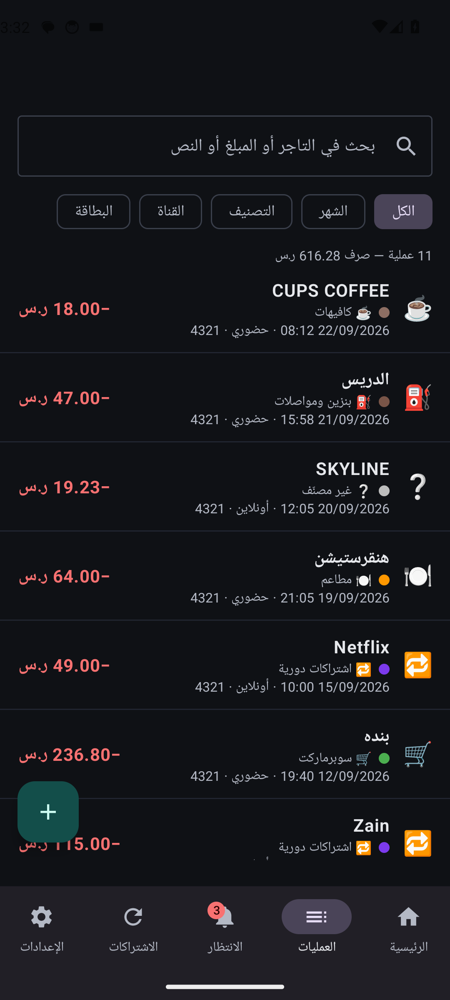
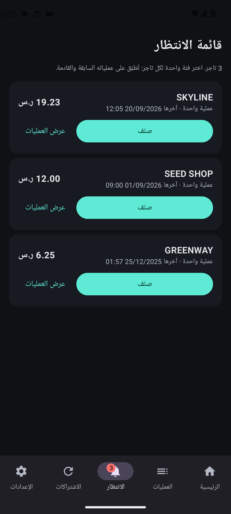
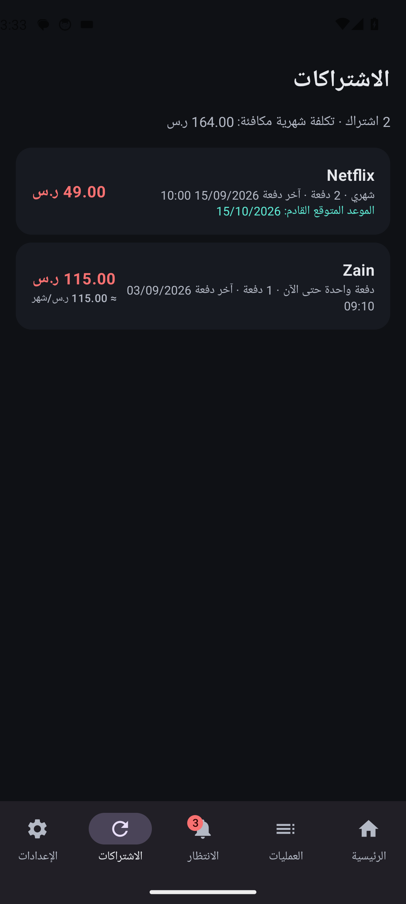

# مصاريف

تطبيق أندرويد يقرأ رسائل البنك على جهازك، يصنّف مصروفاتك تلقائياً، ويعرض إحصائياتك واشتراكاتك.
بلا إنترنت، بلا حسابات، بلا سيرفر. **يدعم حالياً بنك الإنماء فقط.**

  
  
  
  
  

## التثبيت

1. حمّل `masarif-release.apk` من [صفحة الإصدارات](https://github.com/Ahmad-Nayfeh/masarif/releases/latest) وافتحه على الجوال.
2. إن ظهر **Play Protect: App blocked**: افتح متجر Play → صورة حسابك → Play Protect → ⚙️ → أوقف الفحص مؤقتاً، ثبّت، ثم أعد تفعيله.
3. سامسونج: إن ظهر **Auto Blocker** أوقفه من الإعدادات → الأمان والخصوصية، ثم أعد تفعيله بعد التثبيت.

## الإعداد الأول

1. **منح الصلاحيات**: استقبال الرسائل وقراءتها (والإشعارات اختيارياً).
   على أندرويد 13+ إن رُفضت: اضغط مطوّلاً على الأيقونة → معلومات التطبيق → ⋮ → السماح بالإعدادات المقيّدة → الأذونات → الرسائل.
2. **المرسل**: اتركه `alinma` واضغط تحقق.
3. **الفترة**: كم شهراً ماضياً تريد استيراده.

بعدها يستورد التطبيق رسائلك ويبدأ بالتقاط الجديدة تلقائياً حتى وهو مغلق. صنّف التجار الجدد من تبويب **الانتظار** بلمسة واحدة.

## نصائح

- الإعدادات → **تحسين البطارية** لاستثناء التطبيق حتى لا تفوته رسالة. وإن فاتت واحدة: **إعادة مسح الرسائل**.
- الإعدادات → **تصدير نسخة احتياطية** قبل أي تحديث أو تغيير جوال.
- لا تستخدم "إيقاف إجباري" للتطبيق؛ أندرويد يوقف تسليم الرسائل له حتى تفتحه.

## للمطوّرين

- Kotlin + Jetpack Compose + Room. المحلّل في `core/` (Kotlin نقي مع اختبارات لكل صيغة رسالة). الأنماط كلها في `SmsPatterns.kt`.
- GitHub Actions يبني الـ APK، يشغّل الاختبارات على محاكي (إرسال SMS باسم `alinma` والتطبيق مغلق)، وينشر الإصدار في Releases عند تغيير `versionName` على `main`.
- التوقيع عبر أسرار المستودع: `MASARIF_KEYSTORE_BASE64`، `MASARIF_KEYSTORE_PASSWORD`، `MASARIF_KEY_ALIAS`، `MASARIF_KEY_PASSWORD`.
- محلياً: `./gradlew :core:test` (بلا Android SDK)، `./gradlew :app:assembleDebug` (مع SDK).
